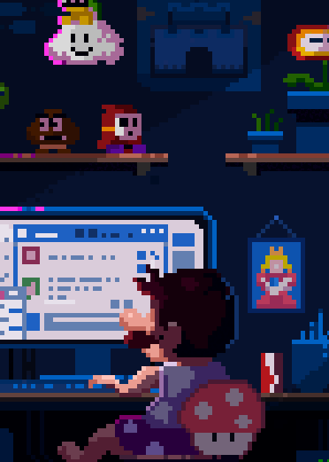

<h1 align="center"> 🔥 Hi! I'm Aaron Ramos 🔥 </h1>

<picture></picture>

<h2>  ABOUT ME 🙋🏽‍♂️</h2>

<picture></picture>

I'm a software engineering student, I'm passionate about data science and frontend development, I discovered my passion when I was in high school. I'm currently learning more about software engineering and searching for more experience in data science.

 

- 🔭 I’m currently working on: generator References in the format APA
- 🌱 I’m currently learning: Python
- 🤔 I’m looking for help with: Data Science
- 📫 How to reach me: aaron.rm.hr@gmail.com
- 😄 Pronouns: he/him
- ⚡ Fun fact: I like racing in F1 🏎️
- 🎮 Add me on PlayStation: `SittingFive56` We play?
- 🎵 Follow me on Spotify: `Aaron RH`

      

<h2> <picture></picture> MY SKILLS 🦾 </h2>

✅ Categories|⭐ Skill 
--------------|---------
Languages|

IDE|

OS|

Tools|

<h2>  MY LAST WORK 💻</h2>

🛠️ Project|🔗 Link|🪐 Demo|💡 Technologies|
-----------|-------|-------|----------------|
Generator references in the format APA|<a href="https://github.com/AaronRHdev/format-APA-generator">Repo</a>|<a href="https://aaronrhdev.github.io/format-APA-generator/">Website</a>|

<h2> <picture></picture>GITHUB ANALYTICS 🧬</h2>

<h2>  CONTACT ME 📧 </h2>

  
  

